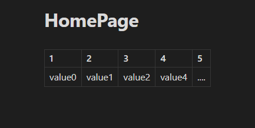

# Obsidian-Codeblock-Template

[简体中文](./README.md)|[English](./README_EN.md)

一个可以把 Code Block 的内容重复利用模板插件！

## 安装

目前这个插件还没上传到 Obsidian 插件库，还需要手动安装。

1. 通过右方 **release** latest 下载`main.js`和`manifest.json`。
2. 在你的插件目录（.obsidian/plugins）新建文件夹`codeblock-template`，并将 main.js 和 manifes.json 文件放入此文件夹即可。

## 使用

### 设置

设置模板存放路径，默认路径为根目录的`templates`。


### 基本使用

**创建模板**

````markdown
```pack-source a
# This is pack-source!
```
````

注意：要在设置中`Template Source Path`指定的路径下创建才有效。

**使用模板**

````markdown
```pack-view a

```
````


### 插值

可以在创建模板时使用`$.{}`来定义变量，在使用时传入变量。

````markdown
```pack-source test1
Hello $.{name}！
```
````

通过`key = value`或`key = "value"`来定义变量。**注意：为了方便存储，key 要符合标识符定义规则[^1]**

````markdown
```pack-view test1
name = "Super10"
```
````


#### 匿名变量

匿名变量的前缀支持通过设置自定义，默认是“anonymous*var*”。**注意：为了方便存储，key 要符合标识符定义规则**[^1]

定义模板

````markdown
```pack-source test_anonymous
| 1                   | 2                   | 3                   | 4                   | 5                   |
| ------------------- | ------------------- | ------------------- | ------------------- | ------------------- |
| $.{anonymous_var_0} | $.{anonymous_var_1} | $.{anonymous_var_2} | $.{anonymous_var_3} | $.{anonymous_var_4} |
```
````

使用模板

````markdown
```pack-view test_anonymous
value0,value1,value2,value4,....
```
````



## 配合其他插件使用

### dataview

`````
````pack-source dv
```dataview
LIST FROM "$.{path}"
```
````
`````

### tasks

`````markdown
````pack-source tasks
```tasks
not done
due after $.{date}
```
````
`````

## 预计开发

-   [x] 批量变量传入
-   [ ] 读取本地 JSON、CSV 数据

[^1]: 标识符可由三类字符：字母、下划线、数字组成；标识符只能由字母或下划线开头
