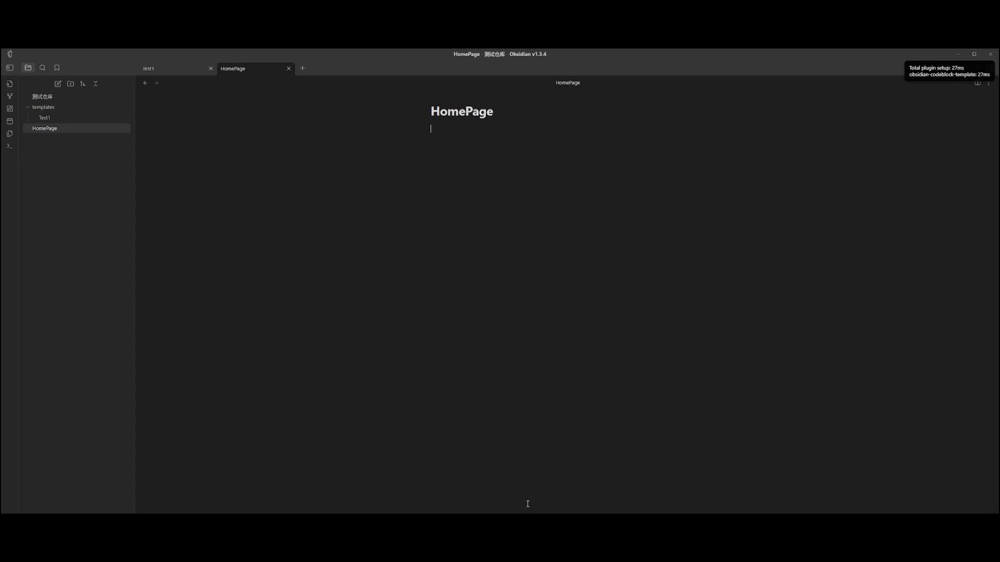

# Obsidian-Codeblock-Template

[简体中文](./README.md)|[English](./README_EN.md)

A template plugin that reuses the content of Code Block!

## Install

This plugin has not been uploaded to the Obsidian plugin repository yet, so you need to install it manually.

1. Download `main.js` and `manifest.json` via **release** latest on the right. 2.
2. Create a new folder `codeblock-template` in your plugin directory (.obsidian/plugins) and put the main.js and manifes.json files into this folder.

## Use

### Settings

Set the template storage path, the default path is `templates` in the root directory.


### Basic usage

**Create templates**

````markdown
```pack-source a
# This is pack-source!
```
````

Note: It has to be created under the path specified by `Template Source Path` in the settings to be valid.

**Using Templates**

````markdown
```pack-view a

```
````



### Interpolation

You can use `$.{}` to define variables and pass them in when they are used.

````markdown
```pack-source test1
Hello $.{name}!
```
````

Define variables by `key = value` or `key = "value"`.
**Note**: For storage purposes, the key should conform to the identifier definition rule [^1].

````markdown
```pack-view test1
name = "Super10"
```
````


## Use with other plugins

### dataview

`````markdown
````pack-source dv
```dataview
LIST FROM "$.{path}"
```
````
`````

### tasks

`````markdown
````pack-source tasks
```tasks
not done
due after $.{date}
```
````
`````

## Next stage

-   [ ] Multiple anonymous variables
-   [ ] Can read local `.csv .json` file data

[^1]: identifiers can consist of three types of characters: letters, underscores, and numbers; identifiers can only start with letters or underscores
